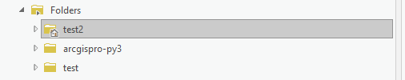
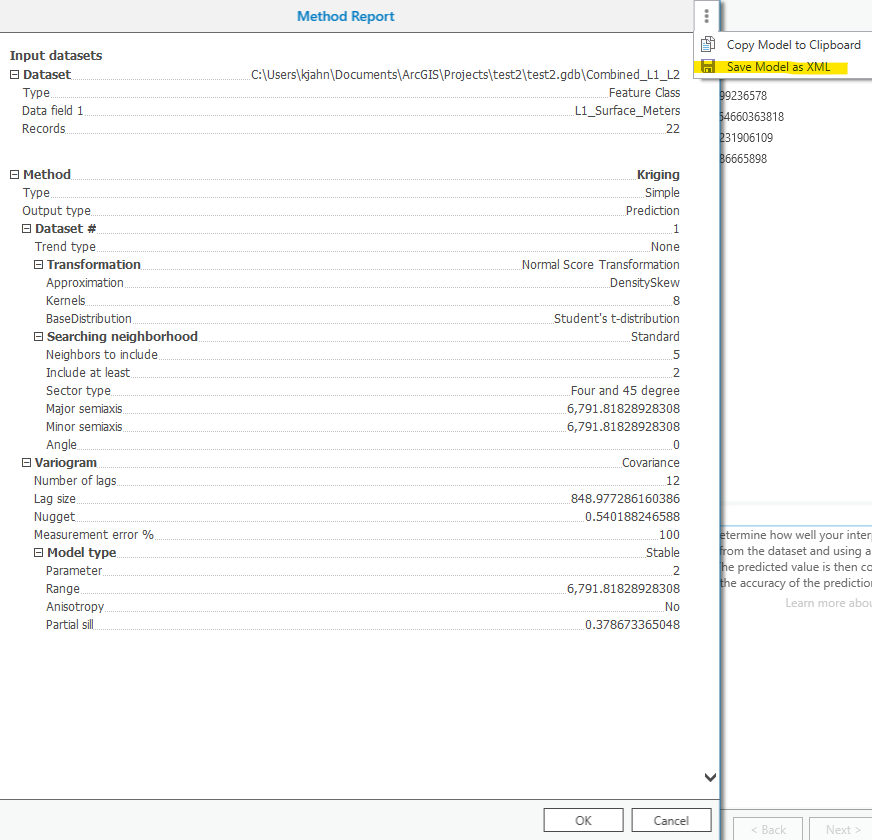
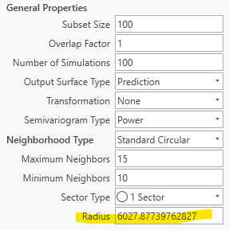
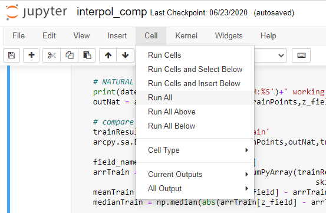

# arcpro-interpol-compare
A Jupyter Notebook intended to reduce the amount of time spent manually comparing results from interpolation tools in ArcGIS Pro.

[TOC]

## General Overview
The Jupyter notebook (“interpol_comp.ipynb”) runs the following interpolation tools available in ArcGIS Pro: Topo To Raster, Natural Neighbor, and the kriging tools in the Geostatistical Wizard (Simple, Ordinary, Universal, and Empirical Bayesian). The results of the methods are compared using cross-validation statistics and by “training” an interpolation surface using some percentage of the data and comparing that surface to the remaining “testing” data. This notebook is intended to reduce the time spent manually comparing the interpolation results and should be used as an initial appraisal of interpolation methods; it is not an exhaustive assessment.

## Downloading the notebook and files

If you use git, you can clone the repository to your local computer, or if you are not a git user, you can click on the the green “Code” button a select “Download ZIP” from the dropdown.

## Input file preparation

Create a new ArcGIS Pro project. The project folder and geodatabase are where you will keep the input files described below.
### Required input files
- A **point feature class** (to be interpolated) stored **in the project geodatabase**. **Make sure this feature class does not have a field called “RASTERVALU”.** Rename that field to something else if necessary.
- **Three XML files** containing kriging model parameters **stored directly in the project folder** (the folder with the house symbol in ArcGIS Catalog), **not in a subfolder** within the project folder. These files are included with the Jupyter Notebook, but can also be created by the user.

### Optional input files
- A **snap raster** stored in the project geodatabase. This forces all rasters created to share the cell size and orientation of the snap raster.
- A **boundary polygon feature class** stored in the project geodatabase. This is used with Topo to Raster.

### Simple, Ordinary, and Universal Kriging XMLs

Creating Geostatistical layers iteratively using the Python Notebook requires storing kriging model parameters in an XML file. Simple, Ordinary, and Universal Kriging each require an individual XML file, respectively named *“KrigingSim.xml”*, *“KrigingOrd.xml”*, and *“KrigingUnv.xml”*. **These three XML files are included in the notebook distribution**. The notebook edits the included XMLs to adjust the transformation and variogram models used. **You do not need to make your own XML files.**

If you do want to create your own XML files however, it is not difficult to do so. The XML file is created using the Geostatistical Wizard, saved with the specified name in the project folder. To do this, go through the Geostatistical Wizard prompts until you have your desired settings and click the Finish button. In the Method Report window that appears, click the “three dots” menu button in the top right corner and select “Save Model as XML”. Choose the appropriate name for the XML based on the Kriging type (*“KrigingSim.xml”*, *“KrigingOrd.xml”*, and *“KrigingUnv.xml”*).

## Output Files

- **Geostatistical layers** are created and saved in a separate folder within the ArcGIS project folder: **_geostat_layers*, where the asterisk (*) will be the first 10 characters of input points file name
- **Rasters and point feature classes** created during the training/testing portion of the code are saved in the geodatabase. 
- An **Excel file** is saved in the ArcGIS project folder as **_interpol.xlsx*, where the asterisk (*) will be the first 10 characters of input points file name. This file summarizes the cross-validation statistics for each tested interpolation method, and the mean and median prediction error for the 90% and 10% subsets.

## Opening the Jupyter notebook

**Save a copy of the notebook (and the accompanying 3 XML files) inside your ArcGIS Pro folder**. To open the notebook, open the Windows Start menu, navigate to the ArcGIS program folder, and click on the Jupyter Notebook icon located there. This will open a Jupyter Notebook navigation window in your default internet browser. Use this window to navigate to your ArcGIS project folder and click on the notebook file *“interpol_comp.ipynb”*. This will open the notebook in another browser tab.

## Executing the Jupyter notebook

Make sure the three XML files are in your ArcPro project folder, and that your point feature class is in the project geodatabase. If you are using a snap raster and/or boundary polygon, make sure they are also in the geodatabase.

Jupyter notebooks are made up of a series of “cells” that contain code. The cell below the header “Input variables” contains several variables that you must fill (described in Section 5.1). Below that cell are the “Function cells” that contain all the code the notebook runs. At the very end of the notebook are the “Execution cells” that run the functions and report progress as the interpolations are executed. Most users won’t need to edit the Function or Execution cells.

### Input variables

`projGeodb`: The project geodatabase name with extension (e.g. `‘test.gdb’`). Must be a string (in `‘single’` or `“double”` quotes).

`inPoints`: The point dataset feature class filename (e.g. `‘bedrock_elev_pts’`). Must be a string (in `‘single’` or `“double”` quotes).

`zField`: The attribute data to be interpolated (e.g. a column within your point geodatabase such as `‘L1_Surface_Meters’`). Must be a string (in `‘single’` or `“double”` quotes)

`krigTransforms`: A list of the transformations for Simple, Ordinary, and Universal kriging. Currently only the transformations listed are tested. You may delete or comment out the transformations from the list if desired, but you should always keep the  `“None”`. Note that `“TransformationNormalScore”` is only used for Simple kriging.

`ebkRadius`: The Search Neighborhood radius for EBK is calculated by an algorithm within the Geostatistical Wizard. You will need to click through the EBK section of the Wizard until you reach the “General Properties” menu shown below.

`maxLocalPoints`: The number of data points used in the local variograms created during Empirical Bayesian Kriging. If you get Error 040206 (see list of common errors below), increase this number. A larger max will take much longer to run, so try to avoid increasing too much.

`SnapRaster`: A string with the snap raster filename (e.g. `‘SnapRaster_38_1_meters'`). If you do not use a snap raster, this variable must be set to `None` (no quotes). By default, the variable is set to `None`.

`cellSize`: The cell size for the output rasters used in assessing mean and median training/testing error. If you are using a snap raster, then the cell size will be pulled from that raster. If you are not using a snap raster, you must set the cell size manually here. **The units for this variable must be the same as the spatial units for the point feature class.**

### Running the code

Once you have enetered the input variables, run the notebook by clicking on the Cell dropdown menu in the Notebook toolbar, and selecting Run All.

This will execute the whole notebook. As it runs, the notebook in inform you which of the interpolation methods it is working on at the bottom of the notebook. Many of the methods are computationally intensive and may take some time on a personal computer. When the notebook is done, you will have many geostatistical layers and rasters saved to the project folder and geodatabase. You will also have an Excel file saved in the project folder that contains the cross-validation statistics and the training/testing statistics.

If the code experiences an error during execution, it will appear at the bottom of the notebook. Check the common errors and potential solutions listed below. The website StackExchange is also a helpful resource for troubleshooting ArcPy and/or python error messages.

### Data normalization

If your dataset contains values ≤0, the notebook will automatically normalize the data to the lowest value so that all the data is >0. This is done by adding a “normalization factor” to all data points (if the lowest data point is 0, the factor = 0.1). For elevation data this is essentially shifting the datum up to the lowest value. The normalization is necessary to perform certain transformations.

If your dataset does not contain values ≤0, then normalization is not performed.

## Assessing cross-validation statistics

The Excel output file contains various metrics you can use to assess the “goodness-of-fit” of the kriging methods. Below is some helpful information provided by Esri staff on using those metrics (posted at: [How to asses the quality of kriging results](https://community.esri.com/thread/230272-how-to-assess-the-quality-of-kriging-results)).

> The Root Mean Square Standardized should be as close to 1 as possible. If the RMS Standardized is less than 0.8 or more than 1.2, you should typically reject the model. The Root Mean Square is in the units of the data, so it gives an average margin of error for prediction (for example, if the RMS is 3, then on average each predicted value will be off by 3 from the true value at the location). If the margin of error is acceptable, then move to the Mean and decide if the level of bias is acceptable. Again, the Mean is in data units, so it directly measures, on average, how much the values are under- or over-predicted. For example, if the Mean is 0.5, you must decide if it is acceptable that the model on average estimates values that are 0.5 higher than the measured values. 

## Saving interpolation results as a raster

Once you have selected the interpolation model you wish to use, you can use the ArcGIS tool “GA layer to rasters” to save the interpolation results (stored in a geostatistical layer) as a raster. 

If the notebook normalized your input dataset because it contained values ≤ 0, you must bring your final raster out of normalization, regardless of the interpolation method you select. To do so, use the ArcGIS raster calculator to subtract the normalization factor used by the notebook. This factor saved in the output Excel file in the sheet “normalize_factor”.

If you choose to use Natural Neighbors or Topo-to-raster, you must also bring that raster out of normalization using the normalization factor.

## Common python errors and solutions

- **Unsupported raster workspace**: This error can occur if there are no rasters in your geodatabase when the notebook is executed. Use ArcCatalog to create a blank raster dataset in the geodatabase and execute the notebook again. Error is address by Esri here: [pro.arcgis.com/en/pro-app/tool-reference/tool-errors-and-warnings](https://pro.arcgis.com/en/pro-app/tool-reference/tool-errors-and-warnings/040001-050000/tool-errors-and-warnings-45001-45025-045020.htm).
- **Raster creation fails because “RASTERVALU” field already exists**: This error occurs when trying to save raster data to points that have previously had raster data imported to them. ArcGIS Pro doesn’t allow fields with duplicate names, so rename the old “RASTERVALU” to something different and re-run the notebook.
- **Error 040206: Empirical Bayesian Kriging fails**: This error occurs if you have a large input dataset, and the `maxLocalPoints` variable is too low, resulting in the local semivariogram models have too few points relative to the whole data set. Fix this error by increasing `maxLocalPoints`.

