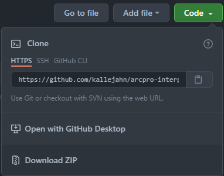

# arcpro-interpol-compare
A Jupyter Notebook intended to reduce the amount of time spent manually comparing results from interpolation tools in ArcGIS Pro.

The notebook (“interpol_comp.ipynb”) runs the following interpolation methods available in ArcGIS Pro: Topo To Raster, Natural Neighbor, and kriging tools in the Geostatistical Wizard (Simple, Ordinary, Universal, and Empirical Bayesian). Method results are compared using cross-validation statistics and by “training” an interpolation surface using some percentage of the data and comparing that surface to the remaining “testing” data. This notebook is intended to reduce the time spent manually comparing interpolation results and should be used as an initial appraisal of interpolation methods; it is not an exhaustive assessment.

## Downloading the notebook and accompanying files

If you use git, you can clone the repo:

` git clone https://github.com/kallejahn/arcpro-interpol-compare.git`

If you are not a git user, you can click on the the green “Code” button above on this page and select “Download ZIP” from the dropdown.

## Using the notebook

Notebook use is outlined in the [documentation](docs/doc.md).

